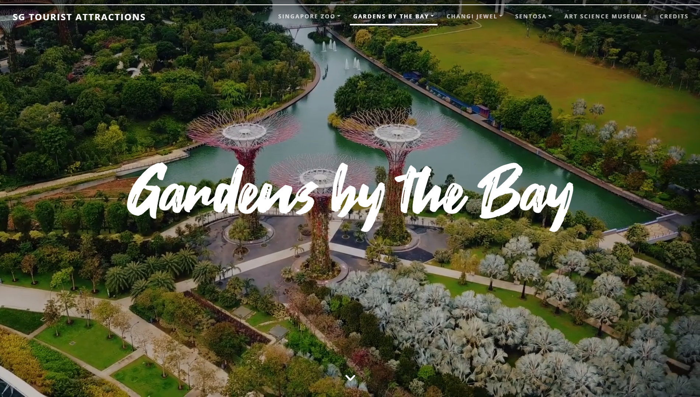
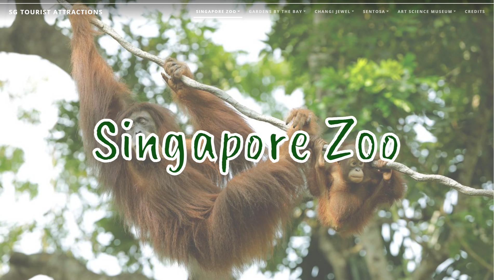
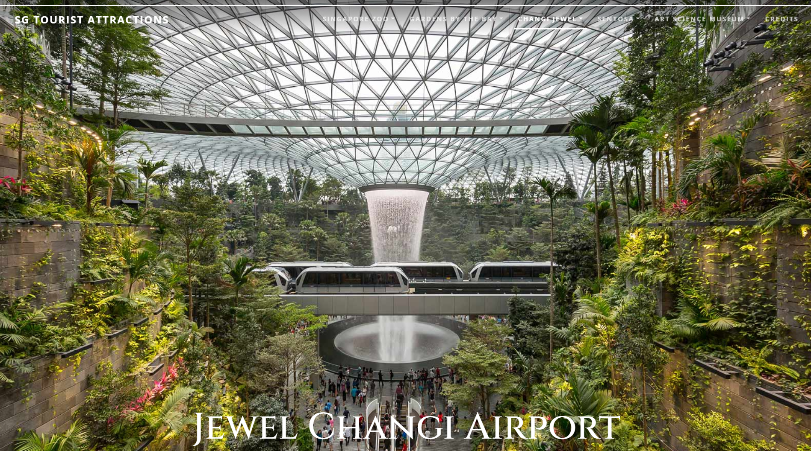
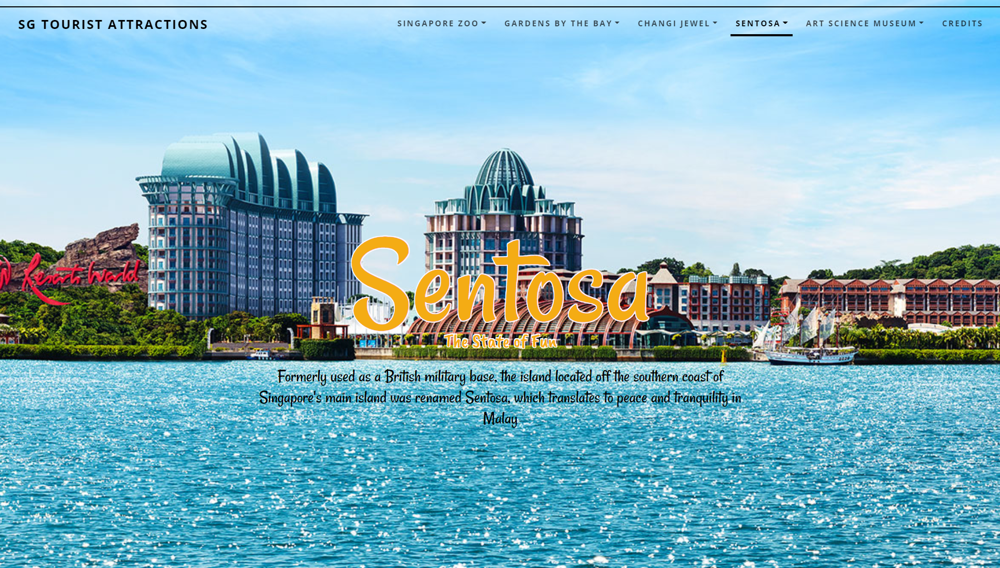



This is a website we developed as part of our Front-End Development module to apply our skills in HTML, CSS and JavaScript. We also use modern APIs and technologies such as Bootstrap and JQuery to aid in development of this site.
 
 The beautiful website showcases some of the most iconic tourist attractions in Singapore.

## Featured Attractions
### [Gardens by the Bay](https://tourist-attractions-web-kpdub.ondigitalocean.app/gardensbythebay.html)

### [Singapore Zoo](https://tourist-attractions-web-kpdub.ondigitalocean.app/zoo.html)

### [Changi Jewel](https://tourist-attractions-web-kpdub.ondigitalocean.app/jewel.html)

### [Sentosa](https://tourist-attractions-web-kpdub.ondigitalocean.app/sentosa.html)

### [Art Science Museum](https://tourist-attractions-web-kpdub.ondigitalocean.app/artscience.html)
